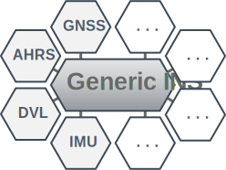

# Generic Inertial Navigation System

A navigation system estimates the state of motion of a system.
The Generic Inertial Navigation System is a multi-sensor data fusion framework that can be used to design a navigation system in MATLAB/Simulink that combines several sensor measurements into a virtual sensor.
An inertial measurement unit (IMU) including a 3D accelerometer and a 3D gyroscope is required to predict the motion.
Additional sensors can be integrated with minimal development effort.


## Key Features

**Wide application range**<br>
The Generic INS can be used worldwide, with the exception of the earth poles.
The earth's rotation is also taken into account.

**Easy to extend with additional sensors**<br>
Thanks to a sigma-point Kalman filter, (non)-linear measurement models can easily be added.
An automatic code generation feature allows the fast creation of embedded MATLAB functions for the fusion of position, velocity, and orientation sensors.

**Different sensor sampling rates**<br>
Due to the sequential sensor method, sensor data are processed one after the other and only when they have been received.

**Transformation to point of interest**<br>
A built-in state transformation can be used to transform the state estimation to a desired point of interest.

**SRSSUKF**<br>
A square-root spherical simplex unscented kalman filter is used.
It is numerically robust and computationally more efficient than other sigma-point Kalman filters.
In addition, some extensions have been added so that quaternions and angles are handled correctly.


## Getting Started
To use the MATLAB package and the Simulink library add the [lib](lib/) and [packages](packages/) directory to the MATLAB path.
Take a look to the [examples](examples/).


## Publication
*Robert Damerius and Torsten Jeinsch, A Generic Inertial Navigation System, 2019 International Interdisciplinary PhD Workshop (IIPhDW), Wismar, Germany, May 2019*
```
@INPROCEEDINGS{Damerius201905:GenericINS,
    AUTHOR="Robert Damerius and Torsten Jeinsch",
    TITLE="A Generic Inertial Navigation System",
    BOOKTITLE="2019 International Interdisciplinary PhD Workshop (IIPhDW)",
    ADDRESS="Wismar, Germany",
    DAYS=14,
    MONTH=may,
    YEAR=2019
}
```
